# Air-Data-Quality-In-Beijing

## Data Analysis Project
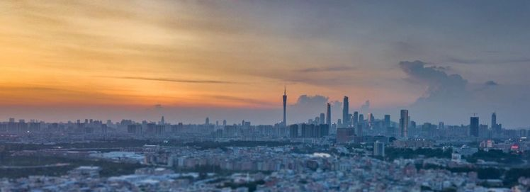
---

## Introduction

This is a power bi project on weather conditions on air quality in Beijing China.  The project is to analyze and provide insights to answer crucial questions and make data-driven decisions

### What Is Air Quality?

Air quality refers to the degree to which the air is suitable or clean enough for humans or the environment.

### What Is PM2.5?

Particulate Matter (2.5) Is an air pollutant that is a concern for people’s health when levels in the air are high. They are tiny particles that are two and one-half microns or less in width, that reduce visibility and cause the air to appear hazy when levels are elevated.

#### About Dataset.

In this dataset, the concentration of particulate matter (PM2.5) in the atmosphere (measured in g/m3) serves as a proxy for air quality. PM2.5 values above 55Ug/m3 indicate poor air quality and levels over 110Ug/m3 indicate severe air pollution. For this analysis, a limit of 100 Ug/m3 was set to denote that the air quality had reached a crucial level. Insight focuses on how atmospheric changes affect how much PM 2.5 is present in the air.

#### Dataset Description

The dataset contains 43824 rows and 13 columns, the data period is between Jan 1st 2010 to Dec 31st 2014. Missing data are denoted as NA.

Column Definition
•	No: row number

•	year: year of data in this row

•	month: month of data in this row

•	day: day of data in this row

•	hour: the hour of data in this row

•	pm2.5: PM2.5 concentration (ug/m^3)

•	DEWP: Dew Point (℃)

•	TEMP: Temperature (oC)

•	PRES: Pressure (hPa)

•	CBD: Combined wind direction

•	Iws: Cumulated wind speed (m/s)

•	Is: Cumulated hours of snow

•	Ir: Cumulated hours of rain

## Problem Statement

•	What can be observed about the PM2.5 concentration concerning time?

•	What is the rate of precipitation(rainfall) and snowfall in the city during each season? Does this influence the concentration of PM2.5?

•	What is the average atmospheric cycle of the city during each season? Do they affect air quality?

•	What is the forecast projection of the PM2.5 value in the next 6 years?

## Skills

The following Power Bi features were used:

•	Dax

•	Bookmarking

•	Power Query

•	Calculated Column

•	Quick Measures

•	Tooltips

## Modelling

Much wasn’t done here because we didn’t need to create any relationships, a one-table dataset was used to create the visuals.

## Data Cleaning

Power bi was used to load, clean, and visualize the dataset. This is the link to the dataset [here](https://archive.ics.uci.edu/ml/datasets/Beijing+PM2.5+Data)

•	The first thing I did in the power query editor was to promote the first row as a header.

•	Filtered all null values ‘NA’ and replaced them with ‘0’
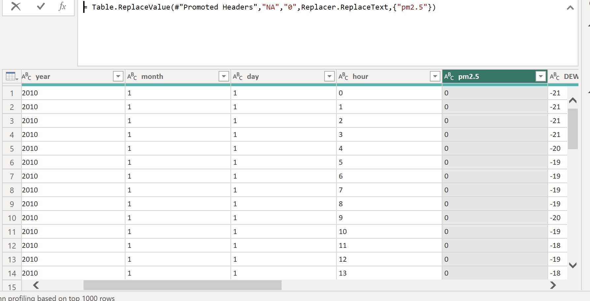

•	Created a ‘Date’ Column by merging the year, month, and day columns and also formatted the datatype to ‘Date’ 
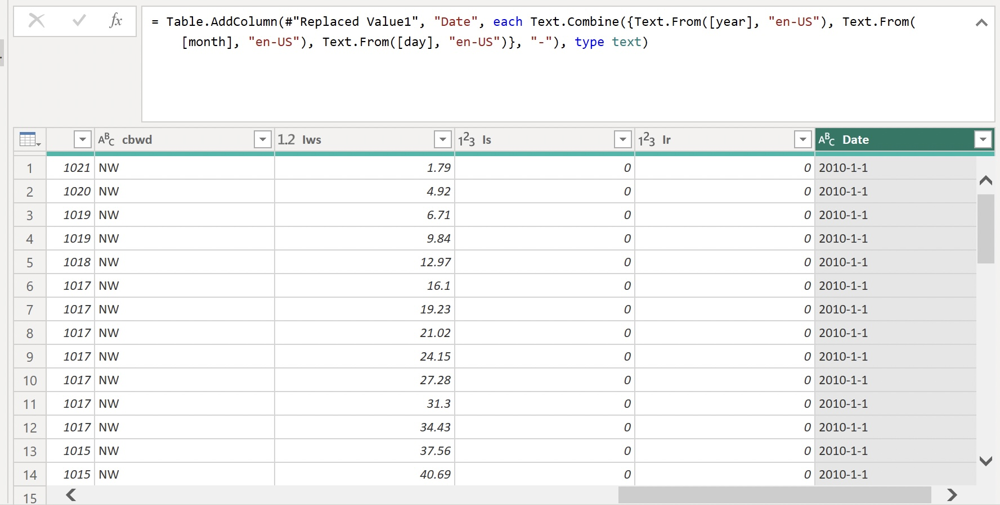

•	Replaced the value of cv to ‘SW’ in the cbwd column as it is a data entry error.

•	Multiplied the PRES column with (0.000987) to format the data to the standard unit which is in ‘atm’ (Atmospheric pressure) from hPa (hectopascal)   
                        1hPa=0.000987atm. 
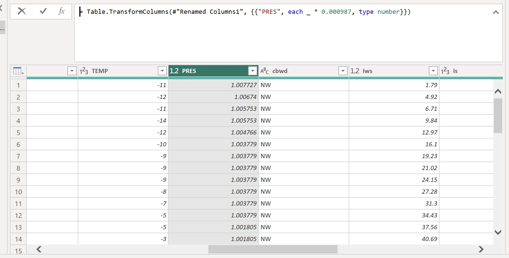                        
                        
•	Created a month name column from the month no column and changed the data type
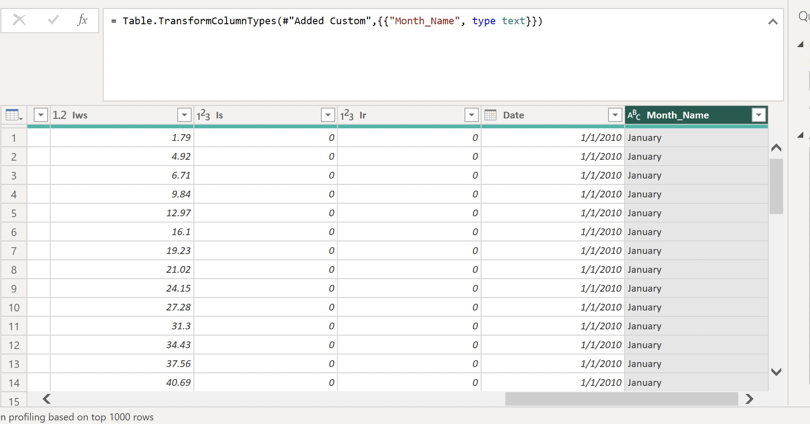

•	Created a short month column by extracting the first 3 characters In the month name column
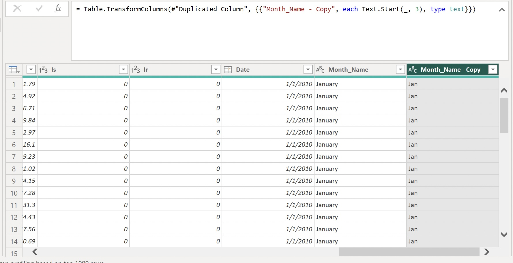

•	Created a column called ‘season’ by duplicating the month column and replacing the values

       Dec-Feb = Winter
       
      Mar-May = Spring
      
      Jun-Aug = Summer
      
      Sep-Nov = Autumn
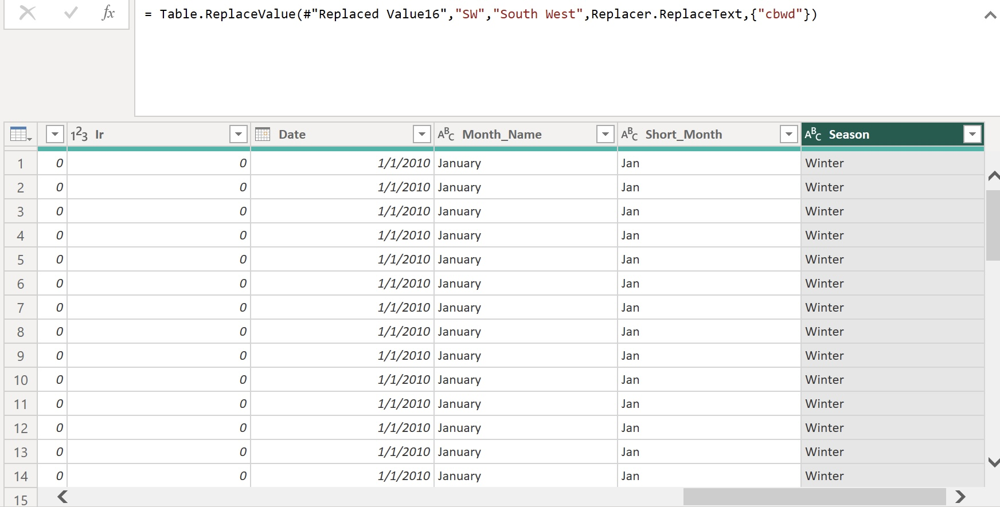

•	I replaced the values in the combined wind direction column 

       SW – Southwest
       
       NW – Northwest
       
       SE – Southeast
       
       NE – Northeast
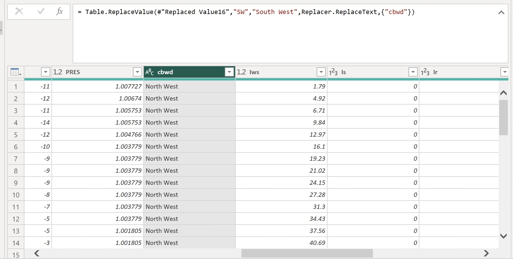       
       
•	I formatted all data types appropriately to whole numbers, decimals, text, and dates.

## Visualization Insight

After Exploring the dataset and doing research on this case study and visualizing the data, I discovered the following insights:
 
The average PM2.5 value over all years and meteorological circumstances is 93.96 Ug/m3, which is quite near the threshold (100 Ug/m3). This observation indicates that the city's air quality is not ideal, with an average PM2.5 level that is below average. 

### Average PM2.5 Concentration (Ug/m3)
After examining the PM2.5 levels for each month and season, it is clear that the winter season, which lasts from December to February, has the highest average PM2.5 levels at about 108.20 Ug/m3. 
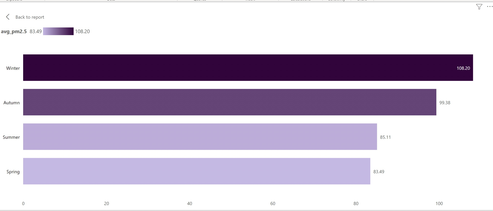
At 99.38 Ug/m3, the average PM2.5 concentration for the autumn season Is points away from the cut-off. In the spring and summer, the average PM2.5 concentration is 83.49Ug/m3 and 85.11Ug/m3, respectively. 

This finding indicates that PM2.5 Is highest during the winter period.

### Average PM2.5 Concentration (Ug/m3) per wind direction

When the wind is blowing more frequently toward the South West and  South East, PM2.5 concentrations are higher. PM2.5 values is relatively low in the North West being 66.83 Ug/m3.
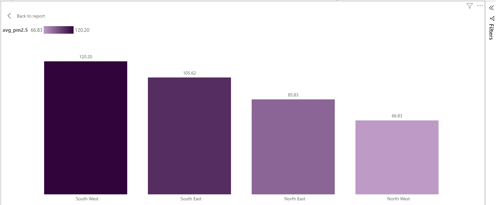
So during the winter period, PM2.5 Is highest in the South West with a value of 120.20 Ug/m3.

### Average Precipitation Time (Hours) and Average snowing time (Hours) by month

Throughout the month, average hours of precipitation (rainfall and snowfall) were recorded. According to the statistics, the summer season (June - August) has the highest incidence of rainfall, while the winter season (December -February) has the highest incidence of snowfall.
The PM2.5 levels are exceptionally high when there are few hours of precipitation (rainfall). In comparison to lengthier amounts of rainfall, PM2.5 levels are low when there are long hours of rainfall.
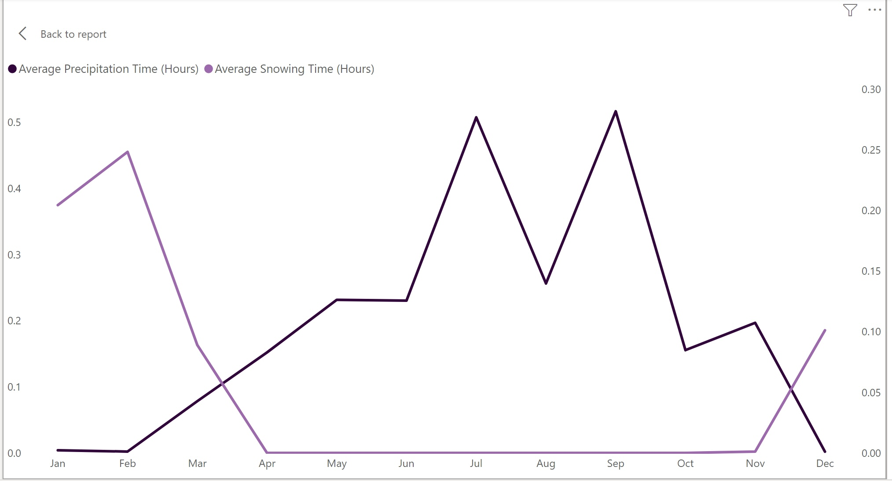

### Average PM2.5 Concentration (Ug/m3) per month across years

The average PM 2.5 value reached its maximum point in February and its lowest point in August. The average PM 2.5 recorded its greatest value in January 2013 at 191.97 Ug/m3, while it recorded its lowest value in January 2011 at 40.55 Ug/m3. The least values were reported in 2012. Throughout the years the PM2.5 was low during the summer and high during the winter. 
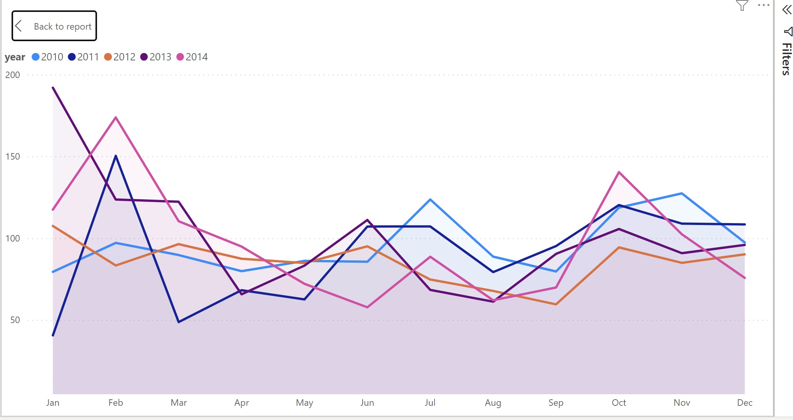

### Weather condition for each season

The atmospheric cycle varies during different seasons, they are always high during the winter except from rainfall which records an average of 0.00 (Hrs) and relatively on average during spring and autumn.
During the summer it becomes hotter and warmer making rainfall increase to an average of 0.33(Hrs), temperature also ranges from -2.85 (Hrs) in the winter to 25.88 (Hrs) in the summer. 
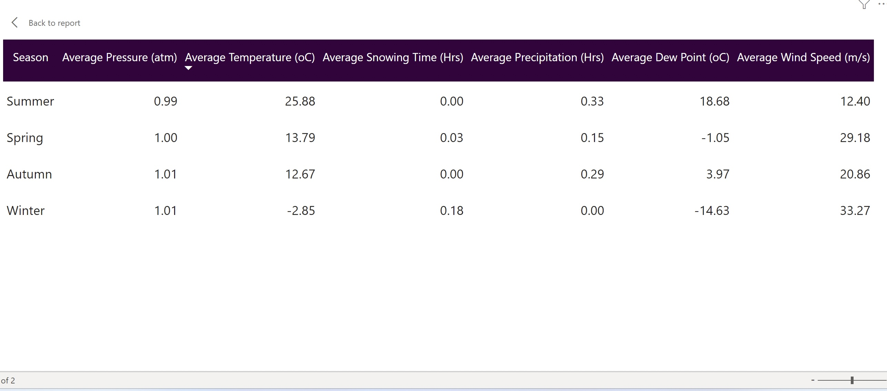

### Forecast
Made a predictive analysis forecast for the next 6 years, it shows what the average PM2.5 value will be from 2015 – 2020. The PM2.5 value reached a peak in 2018 with the PM2.5 averaging 100.76 Ug/m3 and the least was in 2017 with 85.51 Ug/m3.
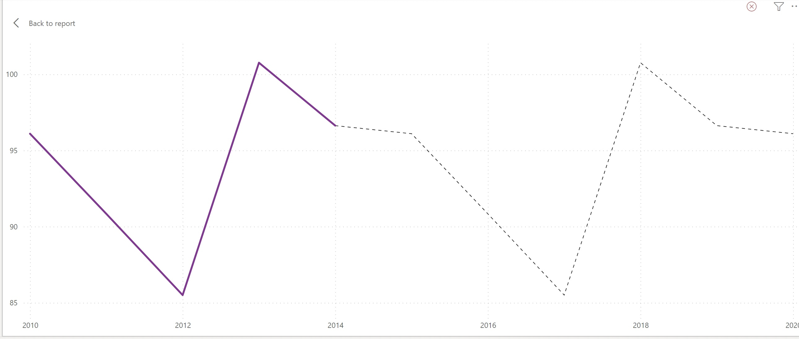

### Live Power Bi Report

click [here](https://app.powerbi.com/links/nj8Gu8iFHD?ctid=a29037ad-c24c-47f1-b52f-ec3218d5c4e9&pbi_source=linkShare)

### Final Visual            
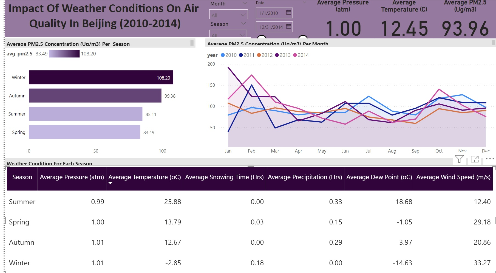.       | 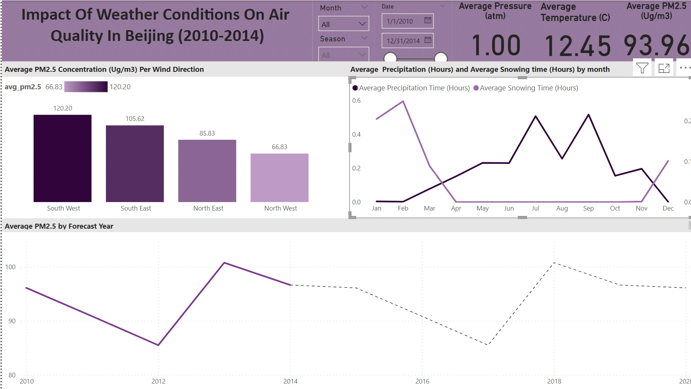

## Recommendation

1. According to the analysis, there have been several hours of rain and snow, which indicates that PM2.5 levels are low. Rain and snow may wash contaminants out of the air and eliminate soluble pollutants. Pollutants are still present despite being washed away or scattered. Just relocating them elsewhere. They are either inhaled by another person or dumped in water bodies for aquatic plants and animals to handle. Those who are particularly susceptible to illness are advised to avoid engaging in too many outdoor activities to avoid contracting an infection.

2. Encourage the creation of green areas since they can help remove PM2.5 from the air. Enhancing urban green areas and planting more trees can boost cities' air quality. 
People may also minimize their own emissions of PM2.5 by using energy-efficient appliances, using the bus or train instead of driving, or walking or bicycling instead of using a car.

3. Over winter, there was a very rapid increase in the PM2.5 concentration. This may be due to the extensive use of coal and other fossil fuels in the production of heat. I suggest replacing biomass fuels, such as wood, coal, animal manure, and agricultural wastes, with cleaner fuels, such as biogas (methane), liquefied petroleum gas (LPG), electricity, or solar cookers, in houses that use them for cooking and heating, also the government can offer subsidies on electricity to encourage the use of electric heaters and discourage its citizens from using gas or burning wood to keep themselves warm.

4. Reduce PM2.5 through pollution abatement measures including installing equipments to remove particulate matter, flue gas desulfurization and denitrification replacing coal with natural gas and expanding clean energy vehicles.

5. When the PM 2.5 concentration is above 110Ug/m3, it is advised that the general public wear pollution masks and use air purifiers indoors. Any concentration of PM 2.5 over that has detrimental effects on health.

